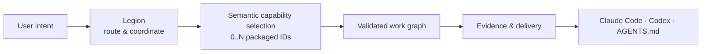
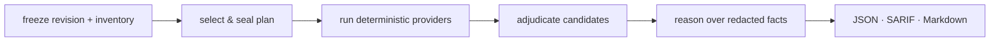

# Legion

Legion makes AI-assisted work legible: it routes each request to the right capability, separates decisions from changes from independent checks, & records evidence before claiming delivery. It is one system projected into Claude Code, Codex, or an `AGENTS.md` harness—not a collection of unrelated prompts.



## What it does

Legion begins with current user intent. Legion selects zero or more capabilities from compact public catalog, deterministic runtime validates IDs, & Legion materializes work graph. Legion attaches authority only where work requires it: Sage for material unresolved meaning/ownership/acceptance, Alchemist for bounded transformation, & Oracle for independent Completion Validation. Arcane owns cognitive processing & response policy. Guard deterministically gates typed effects, reports enforcement health, & owns effect-decision receipts; neither can invent consent.

Work splits into independent units where safe, then reunites at delivery. Capabilities supply expertise, method, workflow, & context; capability never grants authority. Optional domains group catalog entries for discovery only.

## Engineering cohort

| Component | Job | Cannot do |
|---|---|---|
| **Legion** | Interpret live intent, route work, coordinate lanes, report delivery state | Manufacture authority from assistant prose or hooks |
| **Sage** | Exceptionally adjudicate material unresolved meaning, ownership, or acceptance | Own architecture, diagnosis, routine decisions, or implementation |
| **Alchemist** | Apply bounded changes, repair mechanical failures, verify its work | Settle new engineering decisions |
| **Oracle** | Independently perform Completion Validation over requested outcome & evidence | Own Audit/QA/Audit Visual methods or certify its own fix |
| **Arcane** | Shape bounded cognitive processing & response policy | Select capabilities, attach authority, or authorize effects |
| **Guard** | Deterministically gate typed effects, report enforcement health, & own effect-decision receipts | Interpret intent, select capabilities, or attach authority |
| **Covenant** | Isolated challenge chamber over frozen evidence | Override caller authority |

Oracle is independent assurance authority for Completion Validation.

## Catalog grouping

Current catalog uses these optional discovery groups, not routing authorities or a fixed hierarchy:

- **Commercial** — marketing, advertising, social, SEO
- **Research** — general, scientific, & market evidence
- **Editorial** — writing & editorial work
- **Design** — interface, visual, & brand-identity work

Skills supply reusable methods. Legion owns semantic selection, work graph, evidence, & delivery state across all groups.

## Harnesses & fidelity

One doctrine & kernel project into harness-native slots. Legion does not pretend every host exposes identical controls.

| Capability | Claude Code | Codex | `AGENTS.md` readers |
|---|---|---|---|
| Doctrine & routing | yes | yes | yes |
| Native authority agents | yes | host-dependent | host-dependent |
| Guard pre-effect interception | when host hooks support it | when host hooks support it | boundary-gated |
| Receipts | hook or CLI | hook or CLI | CLI/boundary |
| Covenant isolation | engine-owned | engine-owned | engine-owned |
| Oracle Completion Validation | yes | yes | yes |

Run `legion doctor` to inspect current repository, binding, coverage, & host state. Run `legion bind --registrations` to inventory installed hooks across settings & plugins and detect duplicate registrations.

## Install & use

Public package-manager installation is not open yet. Current shipping contract is signed native Legion; Node package remains private development tooling. From a source checkout, Node 22.13+, pnpm, & Rust toolchain are required.

```sh
pnpm install --frozen-lockfile
cargo build --manifest-path engine/Cargo.toml --release --bin legion
engine/target/release/legion --version
```

After installing a signed release-bound binary through an approved channel:

```sh
legion setup --dry-run
legion setup --confirm
legion setup --check
```

Setup detects supported clients, previews exact persistent changes, projects canonical skills & MCP integration through registered host adapters, records rollback state, then verifies installed host-visible state. `setup --check` is read-only. `setup remove --confirm` removes Legion-owned projections while preserving user-owned config.

Claude Code receives packaged plugin surfaces. Codex receives canonical Agent Skills under `.agents/skills` plus MCP registration. Portable Agent Plugins receive one documented umbrella `legion` skill that routes internally; this is a fallback surface, not per-skill fidelity.

For repository audit:

```sh
legion audit .
legion verify .audit/<run>
```

Audit freezes a plan before execution, emits machine-readable evidence, & marks incomplete coverage as unproven rather than clean. Use `legion --help` for current commands.

## Audit engine

Audit is one product capability inside Legion, not Legion's entire identity. It freezes repository revision & file inventory, selects providers deterministically, seals a plan, runs selected checks, keeps security-candidate generation separate from adjudication, & writes JSON, SARIF, plus Markdown output. A skipped required check, stale inventory, missing adjudication, or unproven coverage prevents a clean verdict.



## Repository

- [Architecture & doctrine](doctrine/legion.md)
- [Full manual](references/manual.md)
- [Provider architecture](references/provider-architecture.md)
- [Engine interface](references/engine-interface.md)
- [License](LICENSE)

<sub><b><a href="https://orthic-labs.github.io">Orthic Labs</a></b> — local-first infrastructure for AI-assisted development.</sub>

<!-- blueprint:docs:start -->
## Repository truth docs
- [Product overview](docs/product.md) — what this is and does (generated, code-grounded)
- [Architecture](docs/architecture.md) — components, flows, interfaces (generated, code-grounded)
<!-- blueprint:docs:end -->
