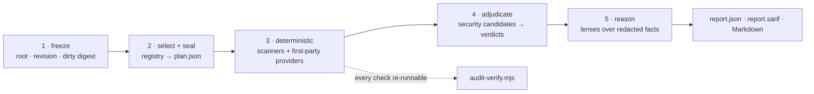

**Nemesis audits a whole repository from a plan it commits to before it looks at the results. It reads the file inventory from Cortex, selects checks deterministically from a declarative registry, seals the selection into a signed `plan.json`, executes exactly that, and emits `report.json` + SARIF. Anything it could not prove — a missing scanner, a stale graph, an unsandboxed build, an unadjudicated security candidate — is recorded as `UNPROVEN` and blocks a clean verdict. Zero findings is not a pass unless coverage was complete.**


```sh
node audit-run.mjs .                                   # audit this repo
node audit-verify.mjs --facts .audit/<ts>/facts.json   # re-prove that run out-of-band
```

Node ≥ 18, zero runtime dependencies, no install step, no daemon, no network.

## Three entry points

| Entry point | What it does |
|---|---|
| **`/audit`** | Freezes scope, seals a plan, executes it, returns a re-runnable report |
| **`/audit-fix`** | Fixes findings and re-audits in a loop until the report is clean or the loop hits a stop condition |
| **`/audit-visual`** | Rendered-state, screenshot-baseline, and viewport-matrix evidence through the same report pipeline |

All three share one registry, one sealed plan, and one reconciliation gate. No entry point may add providers, narrow a denominator, or report clean while something selected was skipped.

## The five stages

Each stage may only consume what the previous one produced. The plan is sealed at stage 2 and never widens or narrows after that.



**1 · Freeze.** Repository root, revision, and a digest of the dirty tree. One fresh Cortex generation is pinned here — its graph is the file inventory for everything downstream.

**2 · Select and seal.** The registry is evaluated against the projected graph, additively: every provider whose selector matches is selected. The result binds revision, dirty digest, Cortex generation, registry digest, provider set, and per-provider path denominators into `plan.json`, sealed with SHA-256 and signed with HMAC-SHA-256.

**3 · Deterministic execution.** Scanners and first-party providers run at `min(cpus-1, 4)` concurrency, each against its frozen path denominator. Each result carries `execution_status` (did the command complete) separately from `verdict` (did it pass) — a command that ran and exited nonzero can never reconcile as a pass.

**4 · Adjudication.** Security candidates go to a different provider in a fresh context. Nothing that generated a candidate may close it.

**5 · Reasoning.** Lenses fan out over redacted facts, each bound to the providers that back it. Findings are re-verified locally before they render.

## How it decides what to run

Selection is a pure function of the projected graph — no heuristics, no "primarily a TypeScript repo" guesses, no agent input. Every provider declares a selector and a required-condition:

| Selector | Fires when | Example provider |
|---|---|---|
| `always` | every run | `core.repo`, `security.secrets` |
| `{ ext: [...] }` | those extensions exist | `security.rust-unsafe` on `.rs` |
| `{ paths: [...] }` | those files exist | `security.docker` on `Dockerfile` |
| `{ deps: [...] }` | that dependency is declared | `react.hooks-config` on `react` |
| `{ scripts: [...] }` | that package script exists | `runtime.app` on `qa:browser` \| `dev` |
| `{ sourceAtLeast: n }` | at least n first-party source files | `security.sast`, `quality.duplication` |
| `{ any: [...] }` / `{ all: [...] }` | composed | `quality.types` on tsconfig **or** `.ts`/`.py` |

| Required-condition | Meaning when unmet |
|---|---|
| `always` | hard failure |
| `manifest` / `typed` / `configured` / `buildable` | not applicable — excluded from the denominator |
| `tool_present` | scanner absent → `UNPROVEN`, recorded, audit stays incomplete |
| `optional` | absent → recorded as a coverage gap, does not block |

A Rust workspace with a `Cargo.lock`, a `Dockerfile`, and no `package.json` therefore gets clippy, `cargo-audit`, `cargo-deny`, `cargo-geiger`, `cargo-machete`, `cargo-outdated`, hadolint, secrets, SAST, duplication, and the always-on repo providers — and never gets `knip`, `npm audit`, or the React provider. That selection is written into the plan before the first scanner runs.

## Provider roles

| Role | May emit | May close its own candidates |
|---|---|---|
| `deterministic` | findings | n/a |
| `candidate-generator` | candidates only | **no** |
| `adjudicator` | verdicts on other providers' candidates | n/a |
| `variant-analysis` | repository-wide sweep for a confirmed finding | n/a |

The registry enforces `sameProviderForbidden`, `sameContextForbidden`, `freshContextRequired`, and `confirmedFindingRequiresVariantAnalysis`. A candidate that never reached an adjudicator is not a finding and does not appear in the report — but it does keep the audit incomplete.

## Security pipeline

A security candidate becomes a finding only by surviving every stage, in order:

1. **Candidate** — file, line, rule ID, claim, threat model, severity hint. Emitted by a candidate-generator, never by the adjudicator.
2. **Attacker control** — who can influence the input. `unproven` fails the verdict.
3. **Reachability** — source-to-sink path through the graph.
4. **Impact** — what breaks, and for whom.
5. **Proof** — the concrete evidence. A surviving verdict requires `evidenceStrength` above `possible`.
6. **False-positive challenge** — a recorded devil's-advocate argument against the finding.
7. **Variant analysis** — repository-wide sweep for the same pattern before closure.

Verdicts missing attacker control, proof, evidence strength, or the challenge are rejected by the adjudication contract, not by convention.

## Coverage, stated honestly

Language and framework families carry a qualification the report inherits. `partial` means the family has providers and a benchmark that has not measured every rule pack. `unproven` means the family is detected and reported as a coverage gap, with no provider yet.

| Qualification | Families |
|---|---|
| `partial` | JavaScript/TypeScript · Python · Rust · Swift/Objective-C · Shell/PowerShell · React · Tauri |
| `unproven` | C/C++ · Java/Kotlin/Scala · .NET · PHP · Go · Ruby · Dart · Elixir/Erlang · Tailwind · Laravel · ASP.NET |

Detected-but-unproven is a reported gap, never a silent pass. Rule packs without a benchmark result ship as `unproven` and block a clean claim on their own.

## `/audit-fix` — the loop

`/audit-fix` is a mutation loop over the frozen plan from a prior `/audit`. It does not select providers, build a second registry, or reinterpret the denominator.

```text
verify plan seal, revision, dirty binding, Cortex generation, provider set, denominators
  ↓  (drift → stop, cut a new /audit plan instead)
fix a bounded batch of unambiguous findings
  ↓
rerun the identical provider contract, finalize the report
  ↓
repeat
```

It stops on the first of: **four batches**, no progress, a regression, plan drift, or a newly introduced high/critical finding.

It will not auto-fix `MANUAL` findings, security findings without completed adjudication and variant analysis, or visual findings without acceptance evidence. It never installs tools, calls the network, or auto-commits. It returns files changed, findings closed, findings still open, regressions, the exact rerun commands, and the new report and SARIF paths.

## What blocks a clean verdict

Any one of these keeps the audit `incomplete` no matter how many findings are open:

- A selected provider that was skipped, errored, or returned `fail`
- A `tool_present` scanner that was absent
- A stale or missing Cortex generation
- An unsigned plan, or a plan whose binding no longer matches the tree
- A provider whose examined path set does not match its sealed denominator
- A security candidate with no adjudication verdict
- A rule pack with no benchmark result
- A project-executing check with no host sandbox receipt

## Requirements

| Requirement | Without it |
|---|---|
| **A current [Cortex](https://github.com/Orthic-Labs/Cortex) generation** — Cortex owns the file inventory, and the plan pins one generation of its graph | Declared-safe providers still run; coverage is `UNPROVEN` and no clean claim is possible |
| `AUDIT_PLAN_SIGNING_KEY` — host-supplied HMAC key | The plan is still a valid integrity artifact, but the audit stays `UNPROVEN` |
| `AUDIT_NETWORK_GUARD=active` — host receipt that network denial is enforced outside the audited process | Build, type, lint, test, and runtime capture stay blocked and report `UNPROVEN` |

Optional third-party scanners (gitleaks, semgrep, pip-audit, cargo-audit, cargo-deny, swiftlint, license-checker, outdated probes) run in a `supplemental` tier: present, they add evidence; absent, they are recorded and the audit still reaches a verdict. They never enlarge the completeness denominator. First-party and project-declared tooling does.

## Outputs

| Artifact | Contents |
|---|---|
| `.audit/<ts>/plan.json` | The sealed, signed provider plan — selection, bindings, denominators |
| `.audit/<ts>/facts.json` | Raw provider results, secret-redacted, with per-check commands |
| `.audit/<ts>/report.json` | Canonical findings, coverage gaps, gates, `audit_status` |
| `.audit/<ts>/report.sarif` | SARIF 2.1.0, dependency-free, for code-scanning consumers |
| Rendered Markdown | Human-readable report |

Every check prints its literal command. `audit-verify.mjs` re-runs the replayable checks out-of-band and compares status and finding counts against the prior report; `build` and sandbox-blocked checks are reported `UNPROVEN` and counted as drift rather than silently skipped.

## Inside

- **`audit-run.mjs`** — canonical entrypoint: pins the Cortex generation, loads the registry, seals and signs `plan.json`, executes the frozen set.
- **`registry/`** — the declarative registry is the executable source of truth; loaders validate and merge, never invent.
- **`providers/`** — first-party suites: security, framework, data, infrastructure, accessibility, visual, generic source, native-family runner.
- **`security-pipeline.mjs`** + **`adapters/security-adjudication.mjs`** — candidate/adjudicator separation and verdict field enforcement.
- **`collect-facts.mjs`** — scanner runner with secret redaction and graceful-skip accounting; records `execution_status` separately from `verdict`.
- **`render-report.mjs`** + **`report-to-sarif.mjs`** — one canonical `report.json`, rendered to Markdown and SARIF.
- **`bench/`** — precision/recall harness over 13 labeled fixtures, with a `--real` mode against production scanners.
- **`tests/`** — unit suites plus an eleven-case conformance runner over the trust invariants.

```sh
node scripts/self-test.mjs                             # syntax + manifest + unit suites
node tests/run-audit-conformance-tests.mjs             # eleven trust-invariant cases
node bench/run-bench.mjs --real                        # detector recall vs production scanners
```

## Reference docs

- [Full manual](references/manual.md) — audit-fix, decomposition, migrations, desktop/Tauri, data safety, report-schema edge cases
- [Provider architecture](references/provider-architecture.md) — ownership, frozen order, offline model, security separation, measured rule packs
- [Engine interface](references/engine-interface.md) — CLI flags, scanner registry, `report.json` contract
- [Lens routing](references/lens-routing.md) — lens/model routing, excerpt policy, verification, reconciliation
- Specialist checklists — [security](references/security-checklist.md) · [performance](references/performance-checklist.md) · [accessibility](references/a11y-checklist.md) · [desktop/Tauri](references/desktop-tauri-checklist.md) · [SQLite local-first](references/sqlite-local-first.md) · [migration safety](references/migration-safety.md)
- [Upgrade plan & locked decisions](UPGRADE-PLAN.md) — the D1–D8 design-decision record and E2E bug ledger

## Repository posture

This checkout is the internal home of the workspace's audit skill — an engine coupled to the Orthic Labs workspace, not a standalone public product. It is source-available, not open source (see [LICENSE](LICENSE)). **Nemesis** is the public name; inside the workspace the skill registers as `audit`, with `audit-fix` and `audit-visual` as bounded companions.

---

<sub><b><a href="https://orthic-labs.github.io">Orthic Labs</a></b> — local-first infrastructure for AI-assisted development.<br>
<a href="https://github.com/Orthic-Labs/nemesis">Nemesis</a> · <a href="https://github.com/Orthic-Labs/Membrane">Membrane</a> · <a href="https://github.com/Orthic-Labs/Cortex">Cortex</a> · <a href="https://github.com/Orthic-Labs/Sentinel">Sentinel</a> · <a href="https://github.com/Orthic-Labs/Roundtable">Roundtable</a> · <a href="https://github.com/Orthic-Labs/Morph">Morph</a> · <a href="https://github.com/Orthic-Labs/SampleApp">SampleApp</a> · <a href="https://github.com/Orthic-Labs/claudecodeX">claudecodeX</a></sub>
