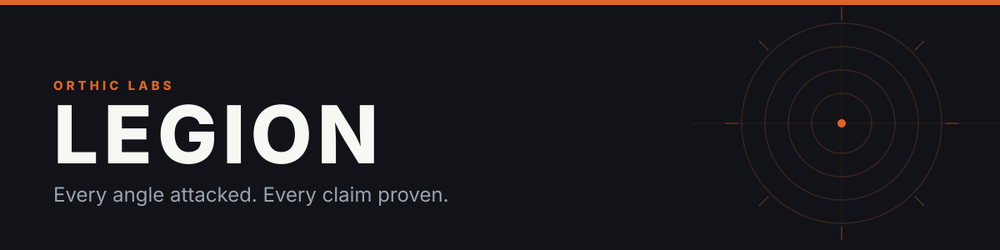
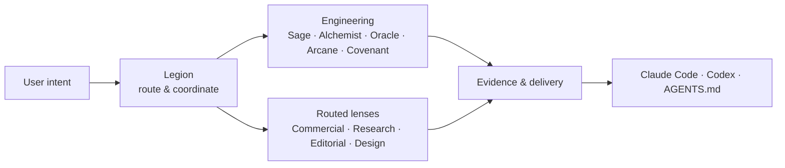
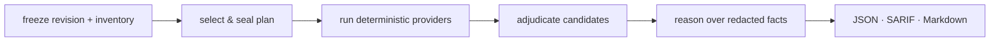

# Legion

Legion makes AI-assisted work legible: it routes each request to the right capability, separates decisions from changes from independent checks, & records evidence before claiming delivery. It is one system projected into Claude Code, Codex, or an `AGENTS.md` harness—not a collection of unrelated prompts.



## What it does

Legion begins with current user intent. A question gets an answer; a small in-scope change is executed directly; a real engineering decision goes to Sage; bounded execution goes to Alchemist; an independent check goes to Oracle. Arcane is the deterministic control plane: it can deny unsafe effects, record receipts, & invalidate stale evidence, but it never invents consent.

Work splits into independent lanes where safe, then reunites at delivery. This applies beyond engineering: Legion routes commercial, research, editorial, & design work through reusable skills & recipes instead of exposing a bag of commands to the user.

## Engineering cohort

| Component | Job | Cannot do |
|---|---|---|
| **Legion** | Interpret live intent, route work, coordinate lanes, report delivery state | Manufacture authority from assistant prose or hooks |
| **Sage** | Diagnose, decide architecture, define invariants, compile executable contracts | Implement its own decisions |
| **Alchemist** | Apply bounded changes, repair mechanical failures, verify its work | Settle new engineering decisions |
| **Oracle** | Independently audit outcome, safety, infrastructure, or historical evidence | Certify its own fix |
| **Arcane** | Deterministic hook & receipt control plane | Grant authority or impersonate judgment |
| **Covenant** | Isolated challenge chamber over frozen evidence | Override caller authority |

Oracle is the assurance authority throughout current doctrine, bindings, & reports.

## Routed lenses

These are reusable reasoning surfaces, not alternate authority stacks:

- **Commercial** — marketing, advertising, social, SEO
- **Research** — general, scientific, & market evidence
- **Editorial** — writing & editorial work
- **Design** — interface, visual, & brand-identity work

Skills supply reusable methods. Recipes combine them when a request needs more than one discipline. Legion owns routing, evidence, & delivery state across all of them.

## Harnesses & fidelity

One doctrine & kernel project into harness-native slots. Legion does not pretend every host exposes identical controls.

| Capability | Claude Code | Codex | `AGENTS.md` readers |
|---|---|---|---|
| Doctrine & routing | yes | yes | yes |
| Native authority agents | yes | host-dependent | host-dependent |
| Arcane pre-effect interception | when host hooks support it | when host hooks support it | boundary-gated |
| Receipts | hook or CLI | hook or CLI | CLI/boundary |
| Covenant isolation | engine-owned | engine-owned | engine-owned |
| Oracle audit | yes | yes | yes |

Run `legion doctor` to inspect current repository, binding, coverage, & host state. Run `legion bind --registrations` to inventory installed hooks across settings & plugins and detect duplicate registrations.

## Install & use

Node 22.13 or newer is required. The package has one runtime dependency, `@rightkit/hooks`, which normalizes host hook events for the Claude Code and Codex adapters. `npm install` pulls it in; a checkout without it cannot run the Arcane host adapters or their tests.

```sh
npx @orthic-labs/legion init
legion bind . --check
legion doctor .
```

`init` previews repository audit configuration. `bind --check` reports projected harness bindings without writes; `bind --write` writes selected bindings & a receipt. `doctor` reports measured state instead of claiming enforcement the host cannot provide.

For repository audit:

```sh
legion audit .
legion verify .audit/<run>
```

Audit freezes a plan before execution, emits machine-readable evidence, & marks incomplete coverage as unproven rather than clean. Use `legion --help` for current commands.

## Audit engine

Audit is one product capability inside Legion, not Legion's entire identity. It freezes repository revision & file inventory, selects providers deterministically, seals a plan, runs selected checks, keeps security-candidate generation separate from adjudication, & writes JSON, SARIF, plus Markdown output. A skipped required check, stale inventory, missing adjudication, or unproven coverage prevents a clean verdict.



## Repository

- [Architecture & doctrine](doctrine/legion.md)
- [Full manual](references/manual.md)
- [Provider architecture](references/provider-architecture.md)
- [Engine interface](references/engine-interface.md)
- [License](LICENSE)

<sub><b><a href="https://orthic-labs.github.io">Orthic Labs</a></b> — local-first infrastructure for AI-assisted development.</sub>
