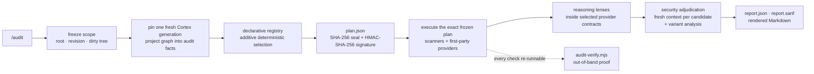

**Most AI code review is a single LLM pass guessing at things a scanner could prove. Nemesis attacks a whole repository from every angle — secrets, dependency CVEs, type errors, dead code, duplication, SAST, license risk, CI and container flaws, architecture drift, AI-slop, runtime behavior, rendered UI — and binds every claim to evidence: a frozen, sealed, and signed provider plan, scanner output that re-runs line by line, and typed `UNPROVEN` degradation wherever proof is missing. It is named for the goddess who punished hubris — including the hubris of a clean bill of health without evidence.**


## Three entry points

| Entry point | What it does |
|---|---|
| **`/audit`** | Freezes scope, seals and signs a deterministic provider plan, executes it exactly, and returns a re-runnable audit report with bounded findings |
| **`/audit-fix`** | A bounded mutation loop over the same frozen plan — fixes unambiguous findings, re-runs the identical provider contract, caps at four batches, never auto-commits, never claims a false clean |
| **`/audit-visual`** | A thin route over the shared visual provider — rendered-state, screenshot-baseline, and viewport-matrix evidence through the same report pipeline |

All three share one engine: the same declarative provider registry, the same sealed plan, the same reconciliation gate. No entry point may invent providers, narrow a denominator, or report clean while anything selected is skipped, unmeasured, unsigned, or unadjudicated.

## How an audit runs



The plan binds the repository revision, dirty-tree digest, Cortex generation, registry digest, provider set, and expected denominators. Anything that cannot be proven — a missing scanner, a stale generation, an unsigned plan, an unsandboxed build — is recorded as `UNPROVEN` and keeps the audit incomplete. Zero findings is never a pass unless coverage is complete.

## What makes it different

- **Frozen, sealed, signed plans.** The provider set is selected deterministically from a declarative registry, then bound to revision, dirty tree, Cortex generation, and denominators. The agent never adds, removes, or narrows providers after execution begins.
- **`UNPROVEN` instead of silent clean.** Missing scanners, stale generations, unsigned plans, unsandboxed builds, unmeasured rule packs — every gap is typed degradation that blocks a clean claim. A finding-free report with incomplete coverage is still an incomplete audit.
- **Security findings survive cross-examination.** Candidate generators may not close their own candidates. A different provider adjudicates each one in a fresh context — threat model, attacker control, source-to-sink reachability, impact, proof, false-positive challenge — and confirmed findings require repository-wide variant analysis before closure.
- **Proof lives outside the agent.** Every check prints its literal command; `audit-verify.mjs` re-runs the replayable checks out-of-band and compares their status and finding counts against the prior report. `build` and any sandbox-blocked check are reported `UNPROVEN` and counted as drift, never silently skipped. The agent is never the thing that proves it did the work.
- **Offline-first execution.** No installs, no mutable ruleset fetches, no external model APIs, no network. Project-executing checks run only behind a host-enforced sandbox receipt — environment variables are defense in depth, never proof.
- **Discovery has exactly one owner.** Cortex owns files, languages, symbols, and graphs, and every plan pins one fresh generation of it; Nemesis owns toolchain, runtime, visual, release, and adjudication evidence. Without a current generation the audit degrades to `UNPROVEN` rather than inventing a parallel file inventory.
- **Optional scanners cannot gate a clean claim.** Eight third-party checks — gitleaks, semgrep, cargo-audit, cargo-deny, swiftlint, license-checker, and both outdated probes — run in a `supplemental` tier: present, they add evidence; absent, they are recorded and the audit still reaches a verdict. Only first-party and project-declared tooling counts toward the completeness denominator.

## The gauntlet

| Front | What it attacks | Backing |
|---|---|---|
| Secrets & credentials | leaked keys, tokens, high-entropy strings | gitleaks + three-stage regex / entropy / file-context credential filter |
| Supply chain | dependency CVEs, license risk, unpinned or vendored deps, stale majors | npm · pnpm · yarn audit, pip-audit, cargo-audit / deny / machete, license-checker, outdated |
| Static security | injection, misconfiguration, unsafe code, CI/CD and container flaws | semgrep · actionlint · hadolint · cargo-geiger · binary-pin checks |
| Types, build & lint | type errors, build breakage, lint debt | tsc · basedpyright · mypy · biome · eslint · ruff · clippy · swiftlint · project build |
| Architecture & dead weight | dead code, duplication, god modules, missing tests/CI/license, TODO sprawl | knip · jscpd · Cortex graph metrics · negative-space & debt-marker checks |
| Frameworks & platforms | framework-specific misuse across 20 coverage families; Tauri contract/capability drift; Apple targets; React hooks config | first-party framework, Tauri, Apple, and React providers |
| Runtime & rendered UI | console errors, performance, accessibility, visual matrix gaps a static pass cannot see | runtime capture · visual core · accessibility suite |
| Reasoning lenses | doc drift, architecture, correctness, AI-slop, naming, dead files, schema drift, security, over-engineering, performance — plus conditional a11y, data-safety, resilience, platform-parity, release-readiness | 15 lenses fanned out over redacted facts; every finding re-verified locally before it renders |

## Measured, not vibes

| Figure | Value |
|---|---|
| Executable providers | 31 deterministic checks + runtime capture + 2 security reasoning contracts, selected additively from a declarative registry |
| Framework coverage families | 20 — Next to Phoenix, Electron to Flutter |
| Reasoning lenses | 10 always-on + 5 conditional, one parallel wave |
| Plan binding | SHA-256 integrity seal + HMAC-SHA-256 authenticity signature over revision, dirty tree, Cortex generation, registry digest, provider set, and denominators |
| Conformance suite | 11 end-to-end cases proving the trust invariants |
| Detector bench | 13 labeled fixtures; precision/recall harness with a `--real` mode against production scanners — unmeasured rule packs block clean claims |
| Runtime dependencies | 0 — Node builtins only |

## Inside

- **`audit-run.mjs`** — the canonical entrypoint: pins a fresh Cortex generation, loads the registry, seals and signs `plan.json`, executes exactly the frozen provider set.
- **`registry/`** — the declarative provider registry is the executable source of truth; loaders validate and merge but may never invent providers or qualifications.
- **`providers/`** — first-party suites: security, framework, data, infrastructure, accessibility, visual, generic source, and the native-family runner.
- **`security-pipeline.mjs`** — enforces candidate/adjudicator separation, rejects context reuse, and gates closure on variant analysis.
- **`collect-facts.mjs`** — legacy scanner runner with secret redaction and graceful-skip accounting; it records `execution_status` separately from `verdict`, so a command that ran and failed can never reconcile as a pass.
- **`render-report.mjs` + `report-to-sarif.mjs`** — one canonical `report.json`, rendered to Markdown and dependency-free SARIF 2.1.0 for code-scanning consumers.
- **`bench/`** — precision/recall harness over labeled fixtures; `unproven` rule packs are coverage gaps, not passes.
- **`tests/`** — unit suites plus an eleven-case conformance runner over the trust invariants.

## Running it

```sh
node audit-run.mjs <root>                              # full audit — Node ≥ 18, zero dependencies
node audit-run.mjs <root> --url http://localhost:3000 --visual-spec spec.json
node audit-verify.mjs --facts .audit/<ts>/facts.json   # re-prove a prior run out-of-band

node scripts/self-test.mjs                             # syntax + manifest + unit suites
node tests/run-audit-conformance-tests.mjs             # eleven trust-invariant cases
node bench/run-bench.mjs --real                        # detector recall vs production scanners
```

### What a complete audit requires

| Requirement | Without it |
|---|---|
| **A current [Cortex](https://github.com/Orthic-Labs/Cortex) generation** — Cortex owns repository discovery, and the plan pins one generation of its graph | The audit still runs its declared-safe providers, but coverage is `UNPROVEN` and no clean claim is possible. Run Cortex against the target repository first. |
| `AUDIT_PLAN_SIGNING_KEY` — host-supplied HMAC key for plan authenticity | The plan is still a valid integrity artifact, but the audit stays `UNPROVEN` |
| `AUDIT_NETWORK_GUARD=active` — host receipt that network denial is enforced outside the audited process | Build, type, lint, test, and runtime capture stay blocked and report `UNPROVEN` |

Nemesis is usable standalone for scanner-backed evidence, but it is built to run beside Cortex: the graph is the file inventory, and a stale or missing generation is treated as missing proof rather than as a clean repository.

No install step and no daemon: the engine is dependency-free Node ESM. Optional scanners (gitleaks, semgrep, pip-audit, cargo-audit, …) are used when present and flagged when absent — never installed mid-run.

## Reference docs

- [Full manual](references/manual.md) — audit-fix, decomposition, migrations, desktop/Tauri, data safety, report-schema edge cases
- [Provider architecture](references/provider-architecture.md) — ownership, frozen order, offline model, security separation, measured rule packs
- [Engine interface](references/engine-interface.md) — CLI flags, scanner registry, `report.json` contract
- [Lens routing](references/lens-routing.md) — lens/model routing, excerpt policy, verification, reconciliation
- Specialist checklists — [security](references/security-checklist.md) · [performance](references/performance-checklist.md) · [accessibility](references/a11y-checklist.md) · [desktop/Tauri](references/desktop-tauri-checklist.md) · [SQLite local-first](references/sqlite-local-first.md) · [migration safety](references/migration-safety.md)
- [Upgrade plan & locked decisions](UPGRADE-PLAN.md) — the D1–D8 design-decision record and E2E bug ledger

## Repository posture

This checkout is the internal home of the workspace's audit skill — an engine coupled to the Orthic Labs workspace, not a standalone public product. It is source-available, not open source (see [LICENSE](LICENSE)). Full proof requires the sibling Cortex skill, which owns repository discovery; without a current Cortex generation the audit still runs its declared-safe providers but stays `UNPROVEN` rather than inventing a file inventory. Naming: **Nemesis** is the public name; inside the workspace the skill registers as `audit`, with `audit-fix` and `audit-visual` as bounded companions. Project-executing checks additionally require a host-enforced network sandbox — the engine never trades proof for coverage.

---

<sub><b><a href="https://orthic-labs.github.io">Orthic Labs</a></b> — local-first infrastructure for AI-assisted development.<br>
<a href="https://github.com/Orthic-Labs/nemesis">Nemesis</a> · <a href="https://github.com/Orthic-Labs/Membrane">Membrane</a> · <a href="https://github.com/Orthic-Labs/Cortex">Cortex</a> · <a href="https://github.com/Orthic-Labs/Sentinel">Sentinel</a> · <a href="https://github.com/Orthic-Labs/Roundtable">Roundtable</a> · <a href="https://github.com/Orthic-Labs/Morph">Morph</a> · <a href="https://github.com/Orthic-Labs/SampleApp">SampleApp</a> · <a href="https://github.com/Orthic-Labs/claudecodeX">claudecodeX</a></sub>
