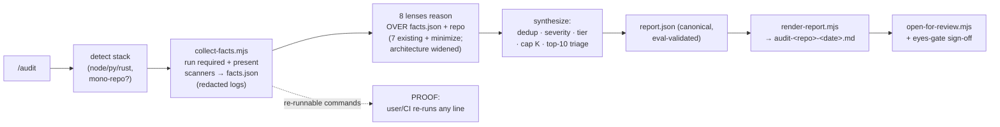

# Audit skill — shipped build plan + design-decision record

> **This build is DONE.** Every file this plan specifies shipped in `3ca7b97a` → `71879d4b` →
> `d82511a6`. Nothing here is outstanding work; do not read the "Build order" section as a queue.
> Retained for the parts that are still load-bearing: the **D1–D8 locked decisions** (§Locked
> decisions), the **Non-goals / ponytail guardrails**, and the E2E bug ledger — `audit-verify.mjs`
> and `SKILL.md` both cite this file for that rationale, so it is not deletable.
>
> The current Blueprint/Audit/Architect ownership and decomposition contract supersedes the
> original raw-LOC gate: `docs/BLUEPRINT-AUDIT-ARCHITECT-WORKFLOW.md` (repo-relative; the previous
> `D:/workspace/...` absolute path did not resolve on macOS).

**Status:** P1–P3 shipped + E2E-validated on `sampleapp` (2026-06-19). `collect-facts` (12 checks, parallel pool + serial build) · `render-report` · `audit-verify` all working; out-of-band verify returns **all-MATCH**; a real run surfaced 2 `undici` CVEs (CVE-2026-9697 / -9678) and proved the secrets/build/dedup paths. Remaining slivers: ruff/clippy lint, knip/jscpd finding-counts, and the semgrep/actionlint/hadolint *ran*-paths (those tools aren't installed on this box). · **Scope:** rewrite `skills/audit/` into one E2E hybrid repo-auditor that proves its own work and writes an implementable report.

> **E2E bugs caught & fixed (2026-06-19):** (1) Windows false-clean — `cmd.exe` returns exit 1 (not 127) for a missing tool, so absent `gitleaks` reported "ran, 0"; fixed via `spawn` ENOENT detection. (2) `gitleaks dir` read 10 GB of `node_modules` → 12,764 false positives; switched to `gitleaks git` (tracked history, ~1 s, 0 leaks). (3) dedup over-merged two distinct `package.json` CVEs; line-less findings now dedup by title. (4) uninstalled `npx` tools (knip/jscpd) reported "ran" because `looksMissing` didn't catch `npx canceled`; fixed.

> **Post-ship absorbs (2026-06-19, from the GLM/Kimi/DeepSeek design docs):** added `negative_space` (missing tests/CI/LICENSE/lockfile/README), `outdated` (majors behind), and `debt_markers` (TODO/FIXME + `ponytail:`) deterministic checks; sharpened ai-slop/minimize/doc-drift/architecture lens cues (swallowed exceptions, >3 bool args, cross-file identical comments, tool sprawl, stack suitability); added a headline **health score**; and an **`audit-fix` loop** mode (fix → re-run scanners → loop until clean; cap 4 + no-progress + regression guards; AUTO/unambiguous-GUIDED only, never MANUAL, never auto-commit, no false "all clean"). Deliberately skipped (over-engineering): weighted-scoring YAML, SARIF/HTML reporters, LLM perf/observability lens.

---

## Context

Three things forced this plan:

1. **The current `audit` skill is a declarative spec that nothing runs.** Verified: `repo-auditor*` / `repository-audit-report` appear *only* in its own `SKILL.md` + `evals.json` (no runner, no sub-auditor agents); `auto-jury.mjs` `KIND_TO_SKILL` has no audit kind (the gate the frontmatter declares would throw `unknown kind`); `council/models.yaml` has zero audit entries (jurors `glm-5.1`/`deepseek-v4-pro` unregistered). An agent invoking `/audit` today just reads the spec and improvises a single pure-LLM pass.
2. **It has zero deterministic backing.** `allowed_tools` lacks shell, so it *cannot* run a scanner. It asks an LLM to *guess* at objectively-checkable things (secrets, CVEs, dead code, type errors) — the exact failure mode CodeRabbit/Sonar/Semgrep engineered around (scanners extract verified facts → LLM reasons over them).
3. **A 5-lens adversarial review (sonnet) returned unanimous "revise"** and reshaped the design: the proof subsystem I first proposed (content-hashing + in-agent verify gate) was simultaneously over-built (Ponytail), gameable (Trust: verifier-capture), and broken (Architecture: scanner output is non-deterministic so hashes never match). All three converge on one fix — **the agent cannot be the thing that proves it did the work; proof must be re-runnable out-of-band.**

**Outcome:** one `/audit`, no second tool, no external plugin dependency. Deterministic scanners produce re-runnable facts → reasoning lenses (incl. the folded-in ponytail lens) reason over those facts → one Markdown report with a re-runnable scanner table, tiered fixes, and an explicit "NOT SCANNED" banner where a tool didn't run.

---

## Visual



```
skills/audit/
├── SKILL.md              ← REWRITE (frontmatter + procedure + lens table + report spec + hard rules)
├── manifest.json         ← NEW   (the check denominator + required-set)
├── collect-facts.mjs     ← NEW   (deterministic scanner runner → facts.json; redaction; graceful-skip)
├── render-report.mjs     ← NEW   (report.json + facts.json → Markdown)
├── audit-verify.mjs      ← NEW   (optional, ~30 lines: re-run required checks out-of-band, diff findings)
└── evals/evals.json      ← EXTEND (keep all existing; add scanner-table / banner / cap / tier / incomplete)
```

---

## Locked decisions (from the review)

| # | Decision | Why (which lens) |
|---|---|---|
| D1 | **Proof = out-of-band re-run, not hashing.** Report prints the literal command per check; user/CI re-runs any line. No `content_hash`, no per-file `sha256`, no in-agent verify gate. | Trust (verifier-capture), Ponytail (self-referential scaffolding), Architecture (non-determinism) |
| D2 | **Required-checks set in `manifest.json`.** A check that is *applicable* (its stack detected, its tool present) but did not reach `ran` stamps the report **INCOMPLETE**. Kills silent skip-flood. | Trust |
| D3 | **"NOT SCANNED — unverified LLM hints only" banner** on any security section whose scanner ≠ `ran`. No clean-bill language without a scanner. | AppSec |
| D4 | **Redact secrets before persisting any log** (field-redact known scanners + entropy/token sweep); owner-only perms; delete logs on success. | AppSec |
| D5 | **JSON is canonical, Markdown is rendered from it.** Keeps `evals.json audit-report-shape` valid (the eval *is* the JSON consumer) while humans read the MD. | overrode Ponytail "drop sidecar" |
| D6 | **One new lens (`minimize` = ponytail fold-in).** `decompose` + `architecture-quality` fold into the existing `architecture` lens as threshold-gated questions — not 3 new lenses. | overrode Ponytail "collapse to one"; kept distinct ops |
| D7 | **Jury/council claim dropped.** `human-eyes-gate` is the *human sign-off* checkpoint, not a verification gate. Council stays unwired (don't build it). | Architecture |
| D8 | **Signal discipline:** per-lens cap (~5 to body, rest to appendix); subjective lenses threshold-gated; one dedup pass; fix tiers AUTO/GUIDED/MANUAL; top-10 triage at head. | Signal/noise |

---

## File 1 — `SKILL.md` (rewrite)

**Frontmatter** (key changes: add shell to `allowed_tools`; drop the unwired jury gate trigger):

```yaml
---
name: audit
description: Whole-repo hybrid audit — deterministic scanners (secrets, deps/CVE, types,
  build/installer hygiene, dead-code, duplication) feed LLM reasoning lenses (doc drift,
  architecture + decomposition + can-it-be-better, ai-slop, naming, dead files, schema/
  contract drift, security, minimize/over-engineering). Audits files AS THEY ARE on disk
  (plain folder or git repo). Read-only. Proves execution via a re-runnable scanner table;
  writes ONE implementable Markdown report with tiered fixes.
allowed_tools: ["read_file", "search", "git_diff", "list_files", "run"]   # +run (shell)
capabilities: ["add_context"]
triggers:
  - on: GoalComplete
    when: "session.has_shippable_artifact"
    action: inject
    enforcement: soft
# (removed: the ArtifactCreated 'require gate ... satisfied_by verdict' trigger — it
#  referenced unwired jury machinery. human-eyes-gate is the checkpoint now.)
---
```

**Body — Procedure (the agent follows this order):**

1. **Detect + collect facts.** Run `node collect-facts.mjs <root>`. It detects stack(s), runs every required+present scanner, writes `.audit/<ts>/facts.json` + redacted per-check logs. The agent does **not** hand-wave any deterministic check — it reads `facts.json`.
2. **Run the 8 lenses over `facts.json` + the repo.** Each lens is fed its relevant facts (table below) and reasons: verify, contextualize, prioritize. A lens may only emit a finding that points to a real `file:line` or a real evidence locus in a log. **Security lenses may not emit clean-bill language for any section whose scanner ≠ `ran`** (D3).
3. **Synthesize.** Dedup across detectors (D8), assign severity, assign fix tier (AUTO/GUIDED/MANUAL), cap each lens to ~5 in the body (overflow → appendix), build the top-10 triage.
4. **Emit `report.json`** (the canonical RepositoryAuditReport, shape below).
5. **Render + surface.** Run `node render-report.mjs` → `audit-<repo>-<date>.md`; then `node ../../lib/open-for-review.mjs <md>`; then the eyes-gate for sign-off.

**Lens table (final):**

| Lens | Fed these facts | Threshold / gate | Cross-checked by |
|---|---|---|---|
| `doc-drift` | git diff of docs vs code, README/CLAUDE.md | — | — |
| `architecture` (widened) | dep graph (`knip`/imports), file+fn sizes | **decompose** only if file >400 LOC or fn >150 LOC; **quality** only on a *named* anti-pattern (god object, cycle, missing boundary) | `knip`, `tsc` |
| `ai-slop` | `jscpd` dup, lint unused, dead exports | — | `jscpd`, lint |
| `naming` | lint, file listing | — | lint |
| `dead-file` | `knip` orphans/unused deps | finding must cite knip locus or be marked `inferred` | `knip` |
| `schema` | `tsc`/`mypy` errors, serialization sites | — | `tsc`/`mypy` |
| `security` | `gitleaks`, `npm/pnpm audit`, `semgrep`, `actionlint`, `hadolint` | **D3 banner if scanner ≠ ran** | the scanners themselves |
| `minimize` *(new — ponytail)* | deps list, lint, file sizes | only if dep unused **and** replaceable in ≤10 stdlib/native lines | `knip`, `jscpd` |

**Hard rules:** read-only (lenses never write/patch); every finding cites file evidence; D3 banner mandatory; required-check skip → INCOMPLETE (D2); logs redacted (D4); the report's scanner table lists each check's literal re-run command (D1).

**Output shape (`report.json`)** — extends the existing schema (keeps evals valid), adds `tier`, `evidence`, `incomplete`, `scanners`:

```json
{
  "kind": "repository-audit-report",
  "generated_at": "<ISO>", "workspace": "<root>", "commit": "<sha>",
  "incomplete": false,
  "scanners": [
    {"check":"secrets","tool":"gitleaks","version":"8.x","command":"gitleaks dir . --report-format json",
     "status":"ran|skipped|error","skip_reason":null,"exit_code":0,"findings_count":0,"log":".audit/.../secrets.log"}
  ],
  "triage_top": ["ra-003","ra-007", "..."],
  "findings": [
    {"id":"ra-001","category":"security|architecture|ai-slop|naming|dead-file|schema-drift|doc-drift|minimize",
     "severity":"critical|high|medium|low","tier":"AUTO|GUIDED|MANUAL",
     "file":"<path>","line":42,"evidence":"secrets.log#L12 | src/x.ts:42",
     "title":"...","detail":"...","action":"...","fix":"<diff or steps>","effort_minutes":15,"sources":["gitleaks","security-lens"]}
  ],
  "summary": {"total":0,"critical":0,"high":0,"medium":0,"low":0,"by_category":{},"by_tier":{}}
}
```

---

## File 2 — `manifest.json` (the check denominator)

The fixed list of every check, with required-when conditions. This is what makes "did it skip a step?" answerable — every entry must appear in the report's scanner table with a terminal status.

```json
{
  "version": 1,
  "checks": [
    {"check":"repo",       "tool":"git",       "required_when":"always",            "applies":"git repo"},
    {"check":"secrets",    "tool":"gitleaks",  "required_when":"tool_present",      "applies":"always", "flag_if_absent":true},
    {"check":"deps_cve",   "tool":"npm|pnpm|yarn audit", "required_when":"manifest","applies":"package.json"},
    {"check":"build",      "tool":"<project build>",     "required_when":"buildable","applies":"build script / Cargo.toml"},
    {"check":"types",      "tool":"tsc|mypy",  "required_when":"typed",             "applies":"tsconfig / py types"},
    {"check":"lint",       "tool":"eslint|ruff|clippy",  "required_when":"configured","applies":"lint config"},
    {"check":"dead_code",  "tool":"knip",      "required_when":"optional",          "applies":"package.json"},
    {"check":"duplication","tool":"jscpd",     "required_when":"optional",          "applies":"any source"},
    {"check":"ci_lint",    "tool":"actionlint","required_when":"optional",          "applies":".github/workflows"},
    {"check":"docker",     "tool":"hadolint",  "required_when":"optional",          "applies":"Dockerfile"},
    {"check":"sast",       "tool":"semgrep",   "required_when":"optional",          "applies":"any source"}
  ]
}
```

Rule: a check whose `applies` condition is met and `required_when` resolves true but `status ≠ ran` → `report.incomplete = true`. `optional` checks skip freely with a reason. `secrets` with `flag_if_absent` + tool missing → loud notice + D3 banner, not a silent pass.

---

## File 3 — `collect-facts.mjs` (deterministic runner)

Structure (cross-platform: Node `child_process`, Windows + Mac):

```
detectStacks(root)            → [{stack:'node', root, pkgMgr, workspaces:[...]}, {stack:'python',...}, {stack:'rust',...}]
                                markers: package.json(+workspaces)/pnpm-workspace.yaml, Cargo.toml(+[workspace]),
                                pyproject.toml/setup.py, go.mod. Unknown stack → git+gitleaks only + loud notice.
toolVersion(tool)             → run `<tool> --version`; missing → null (drives skip)
runCheck(checkDef, ctx)       → spawn command; capture stdout/stderr/exit/duration;
                                normalizeFindings(raw, tool) → [{file,line,rule,severity,message}]
redact(raw, tool)             → field-redact known scanners (gitleaks Secret/Match) +
                                regex sweep for common token shapes → write redacted log (0600 / icacls owner-only)
main(root)                    → for each stack, for each applicable manifest check: runCheck or skip(reason);
                                compute incomplete per D2; write .audit/<ts>/facts.json + logs;
                                print a one-line summary table (so a human watching sees it live)
```

- **Per-package in monorepos:** `audit` at root; `tsc` per `tsconfig`; `build`/`lint` per package; merge into one `facts.checks[]` tagged by package.
- **Findings normalized** (not raw bytes) so dedup + report are stable; raw stays in the redacted log for re-run/inspection.
- **`ponytail:` markers note ceilings**, e.g. redaction: `// ponytail: field-redact known scanners + entropy sweep; ceiling: novel secret format in an unknown scanner could leak; upgrade: per-scanner redactor`.

Scanner commands (the literal re-run lines the report prints):

| check | command |
|---|---|
| secrets | `gitleaks dir . --report-format json --report-path <log>` |
| deps_cve | `pnpm audit --json` / `npm audit --json` |
| build | `pnpm build` / `cargo build` / `npm run build` (project's own) |
| types | `npx tsc --noEmit` / `mypy <pkg>` |
| lint | project's `eslint .` / `ruff check` / `cargo clippy` |
| dead_code | `npx knip --reporter json` |
| duplication | `npx jscpd . --reporter json --silent` |
| ci_lint | `actionlint -format '{{json .}}'` |
| docker | `hadolint --format json <Dockerfile>` |
| sast | `semgrep --config auto --json` |

---

## File 4 — `render-report.mjs` (report.json + facts.json → Markdown)

Deterministic. The template **is** the visual-plan-style output:

```markdown
# Audit — <repo> · <date> · <commit>
<!-- INCOMPLETE badge here if report.incomplete -->

## 1 · Proof — scanner coverage   ← re-run any command to verify
| check | tool@ver | command | status | exit | findings | log |
|-------|----------|---------|--------|------|----------|-----|
| secrets | gitleaks@8.x | `gitleaks dir . …` | ✅ ran | 0 | 0 | .audit/…/secrets.log |
| sast    | semgrep      | `semgrep …`        | ⚠ skipped (not installed) | — | — | — |
> ⚠ **NOT SCANNED: sast.** Findings in §Security from this check are unverified LLM hints, not scan results.

## 2 · Top 10 that matter   (severity × confidence × blast-radius)
1. [critical][AUTO] ra-003 — hardcoded API key — `src/api.ts:42` …

## 3 · Findings by remediation type
### Secure (3) · ### Refactor (5) · ### Delete (4) · ### Simplify (6) · ### Docs (2) · ### Schema-fix (1)
**[ra-003] Hardcoded API key**  severity: critical · tier: AUTO · `src/api.ts:42` · evidence: secrets.log#L12
> detail … 
```diff
- const KEY = "sk-live-..."        ← AUTO: deterministic, safe to apply
+ const KEY = process.env.API_KEY
```

## 4 · Skipped / not-scanned   (every manifest check accounted for)
## 5 · Appendix — overflow findings · raw logs · full re-run commands
```

Fix-tier legend rendered inline: **AUTO** (deterministic, safe) · **GUIDED** (diff shown, needs judgment) · **MANUAL** (file:line + explanation, no diff — architecture/decompose).

---

## File 5 — `audit-verify.mjs` (optional, the "prove it" button)

~30 lines. Re-runs only the **required** checks from `manifest.json` against the same repo and diffs the *normalized findings* vs `report.json`. Intended to be run **by the user or CI, not the agent** (D1/Trust). Output: `MATCH` / `DRIFT: <check> agent-reported N, re-run found M`. This is the direct, mechanical answer to "how do I know it didn't skip a step."

> ponytail: ship the report's per-row commands first (zero new code); add this only if you want one-command verification. Included because proof is your stated #1 concern.

---

## File 6 — `evals/evals.json` (extend; keep all existing)

Add to the existing `output_quality` / `safety` sets:

| new id | mode | asserts |
|---|---|---|
| `audit-scanner-table` | static | report contains §Proof scanner table; every manifest check present with a terminal status + re-run command |
| `audit-not-scanned-banner` | static | a security check with status≠ran → its section shows the NOT-SCANNED banner; no clean-bill text |
| `audit-required-incomplete` | static | an applicable required check skipped → `report.incomplete==true` + INCOMPLETE badge |
| `audit-finding-cap` | static | each lens ≤ cap in the body; overflow lives in the appendix |
| `audit-fix-tier` | static | every finding carries tier ∈ {AUTO,GUIDED,MANUAL} |
| `audit-rerunnable` | static | scanner table lists the literal command per check |

Existing evals (discovery, `audit-report-shape`, `audit-read-only`, `audit-no-invented-findings`, alias) stay unchanged — D5 keeps the JSON shape they validate.

---

## Non-goals (deliberately not built — ponytail guardrails)

- ❌ No content-hash / sha256 binding subsystem (D1).
- ❌ No in-agent verify gate (verifier-capture; D1/Trust).
- ❌ No jury/council wiring (unbuilt; D7).
- ❌ No external plugin dependency (ponytail folded in as a lens).
- ❌ No 40-scanner engine — ~6 required + ~5 optional, on-demand, graceful-skip.
- ❌ No agent-native MCP / browser stack — a Markdown file + `open-for-review` is the lazy equal.
- ❌ No auto-apply — report-only (fixes are *in* the report; applying is a deliberate follow-up).
- ❌ No global tool auto-install — use what's present; loudly report what's absent.

---

## Build order

| Phase | Ships | Gives |
|---|---|---|
| **P1 (core)** | SKILL.md rewrite · manifest.json · collect-facts.mjs (required: git, gitleaks, audit, build, tsc, lint) · render-report.mjs · open+eyes wire | A real hybrid audit with a re-runnable scanner table and tiered fixes |
| **P2 (depth)** | optional scanners (knip, jscpd, actionlint, hadolint, semgrep) · dedup pass · audit-verify.mjs | Dead-code/dup/CI/Docker/SAST coverage + one-command proof |
| **P3 (gate)** | evals additions · run on 2 sample repos | Regression-guarded + demonstrated E2E |

---

## Verification (how we'll prove the upgrade works)

1. **Node/Tauri repo** (e.g. `D:/workspace/readright/`): run `/audit`. Confirm scanner table shows `audit`+`tsc`+`build` ran; findings carry tiers; report opens via `open-for-review`.
2. **Banner path:** temporarily ensure `gitleaks` is absent → confirm §Security shows the NOT-SCANNED banner and no clean-bill.
3. **INCOMPLETE path:** point at a repo whose `build` fails / a required check unrunnable → confirm `report.incomplete==true` + badge.
4. **Cap/triage:** on a messy repo, confirm ≤5/lens in body, overflow in appendix, top-10 present.
5. **Proof:** copy a command from the scanner table, re-run it by hand → same finding count. (Or `audit-verify.mjs` → `MATCH`.)
6. **Evals:** run the skill eval set; all existing + 6 new pass.

---

## One open fork (defaulted)

**Out-of-band verification UX** — defaulting to **ship both, phased**: P1 prints re-run commands in the scanner table (zero new code, satisfies D1); P2 adds `audit-verify.mjs` (the one-command "prove it" button, ~30 lines). Say the word if you want P1 commands-only and to drop `audit-verify.mjs`.
